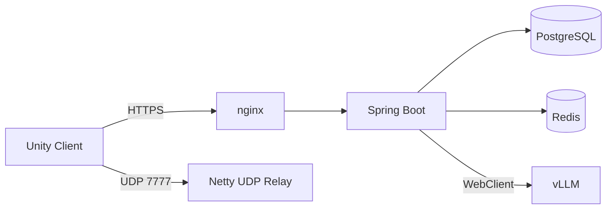

# 🎮 Lost Memory

Unity 기반 1~4인 온라인 협동 로그라이크 게임입니다.

플레이어가 함께 스테이지를 진행하며 전투와 보상을 반복하고, 선택한 유물과 무기에 따라 빌드를 구성해 보스에 도전합니다.

> SSAFY 최종 프로젝트 · 2026.04.06 ~ 2026.05.26 (7주)

[▶ 시연 영상](https://drive.google.com/file/d/1BRPYyc1wItc8MelCPIopFKPuydAKCeMf/view?usp=drive_link)

---

## 프로젝트 개요

| 항목 | 내용 |
| --- | --- |
| 기간 | 2026.04.06 ~ 2026.05.26 (7주) |
| 인원 | 6명 (Backend 2 / Client 3 / AI 1) |
| 담당 | Backend / Infra |
| Backend | Spring Boot, Java 17, Netty, WebClient |
| Data | PostgreSQL, Redis |
| Infra | Docker, nginx, Jenkins, GitLab |
| AI | vLLM, ComfyUI |

---

## 주요 구현

### Netty 기반 UDP Relay

실시간 게임 데이터를 중계하기 위해 Netty 기반 UDP Relay 서버를 구현했습니다.

하나의 UDP 포트에서 게임 데이터와 `HELLO`, `BYE`, `PING` 같은 제어 메시지를 함께 처리하며, 게임 데이터는 Binary Packet으로 전달합니다.

```text
[Magic Byte][senderUserId][targetUserId][payload]
```

패킷의 첫 바이트를 `Magic Byte`로 사용해 게임 데이터 여부를 먼저 판별하고, 제어 메시지에 대해서만 JSON을 파싱하도록 처리 경로를 분리했습니다.

### LLM 연동 및 응답 스트리밍

Spring Boot에서 WebClient를 이용해 vLLM과 연동하고, LLM 응답은 SSE를 통해 스트리밍하도록 구성했습니다.

### ComfyUI 이미지 생성 워크플로우

게임 이미지 리소스 제작 과정에서 ComfyUI를 활용했습니다.

한 장의 결과물보다 팀원이 같은 절차를 사용해 유사한 스타일의 이미지를 반복해서 생성할 수 있도록, 검증한 생성 과정을 ComfyUI 워크플로우 형태로 정리했습니다.

### CI/CD 및 배포

GitLab과 Jenkins를 기반으로 CI/CD 환경을 구성하고, Spring Boot 애플리케이션과 UDP Relay를 Docker 컨테이너로 운영했습니다.

HTTP/HTTPS 요청은 nginx를 통해 Spring Boot로 전달하고, UDP Relay는 호스트의 `7777/udp` 포트를 컨테이너에 직접 publish하여 처리합니다.

---

## 서비스 구성



- **HTTPS**: 인증 및 일반 서비스 API
- **UDP 7777**: 플레이어 간 실시간 게임 데이터 중계
- **vLLM**: LLM 기능 연동
- **PostgreSQL / Redis**: 서비스 데이터 및 캐시 저장

> ComfyUI는 런타임 서비스가 아니라 개발 과정에서 이미지 리소스를 생성하기 위한 로컬 워크플로우로 사용했습니다.

---

## 패킷 판별 벤치마크

프로젝트 당시 JSON 파싱 방식과 Magic Byte 기반 패킷 판별 방식의 처리 시간을 JMH로 비교했습니다.

당시 측정 결과가 저장소에 남아 있지 않아, 포트폴리오 정리 과정에서 실제 패킷 판별 로직을 기준으로 벤치마크를 다시 재현했습니다.

| 방식 | 평균 처리 시간 |
| --- | ---: |
| JSON 파싱 후 타입 판별 | 537.6 ns/op |
| Magic Byte 타입 판별 | 1.525 ns/op |

패킷 종류 판별 시간을 약 **1/353 수준**으로 줄일 수 있음을 확인했습니다.

현재 벤치마크 코드는 `server/src/jmh`에 있으며, GitHub Actions에서는 일반 CI와 분리해 `workflow_dispatch`로만 수동 실행할 수 있습니다.

> 위 수치는 GitHub Actions의 Ubuntu / JDK 17 환경에서 재현한 마이크로벤치마크 결과이며, 전체 UDP 통신 성능을 의미하지 않습니다.

---

## 저장소 구조

```text
LostMemory/
├── client/     # Unity 게임 클라이언트
├── server/     # Spring Boot API / Netty UDP Relay
├── tools/      # ComfyUI 등 개발 보조 도구
├── website/    # 웹 관련 코드
├── docs/       # 게임 기획 및 설계 문서
└── exec/       # 실행 및 배포 관련 자료
```

---

## 상세 문서

프로젝트 진행 중 작성한 기획·설계 문서는 `docs/`에 남겨두었습니다.

- [게임 개요](docs/01_game_overview.md)
- [코어 루프](docs/02_core_loop.md)
- [전투 시스템](docs/03_combat_system.md)
- [멀티플레이 규칙](docs/04_multiplayer.md)
- [백엔드 범위](docs/07_backend_scope.md)
- [AI 제작 파이프라인](docs/11_ai_pipeline.md)
- [ComfyUI 작업 문서](tools/docs/README.md)
- [Relay 패킷 판별 벤치마크](server/docs/relay-dispatch-benchmark.md)

---

## Git LFS

게임 에셋과 같은 대용량 바이너리 파일은 Git LFS로 관리합니다.

```bash
git lfs install
```
