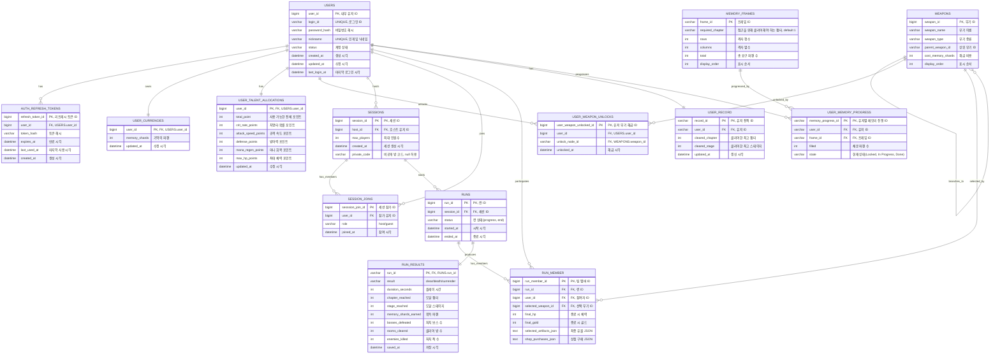

```mermaid
erDiagram

    USERS {
        bigint user_id "PK, 내부 유저 ID"
        varchar login_id "UNIQUE, 로그인 ID"
        varchar password_hash "비밀번호 해시"
        varchar nickname "UNIQUE, 인게임 닉네임"
        varchar status "계정 상태"
        datetime created_at "생성 시각"
        datetime updated_at "수정 시각"
        datetime last_login_at "마지막 로그인 시각"
    }

    AUTH_REFRESH_TOKENS {
        bigint refresh_token_id "PK, 리프레시 토큰 ID"
        bigint user_id "FK, USERS.user_id"
        varchar token_hash "토큰 해시"
        datetime expires_at "만료 시각"
        datetime last_used_at "마지막 사용 시각"
        datetime created_at "생성 시각"
    }

    USER_CURRENCIES {
        bigint user_id "PK, FK, USERS.user_id"
        int memory_shards "기억의 파편"
        datetime updated_at "수정 시각"
    }

    USER_TALENT_ALLOCATIONS {
        bigint user_id "PK, FK, USERS.user_id"
        int total_point "사용 가능한 전체 포인트"
        int crit_rate_points "치명타 확률 포인트"
        int attack_speed_points "공격 속도 포인트"
        int defense_points "방어력 포인트"
        int mana_regen_points "마나 회복 포인트"
        int max_hp_points "최대 체력 포인트"
        datetime updated_at "수정 시각"
    }

    WEAPONS {
        bigint weapon_id "PK, 무기 ID"
        varchar weapon_name "무기 이름"
        varchar weapon_type "무기 종류"
        varchar parent_weapon_id "상위 무기 ID"
        int cost_memory_shards "해금 비용"
        int display_order "표시 순서"
    }

    USER_WEAPON_UNLOCKS {
        bigint user_weapon_unlocked_id PK "PK, 유저 무기 해금 ID"
        bigint user_id "FK, USERS.user_id"
        varchar unlock_node_id "FK, WEAPONS.weapon_id"
        datetime unlocked_at "해금 시각"
    }

    SESSIONS {
        bigint session_id PK "PK, 세션 ID"
        bigint host_id FK "FK, 호스트 유저 ID"
        int max_players "최대 인원수"
        datetime created_at "세션 생성 시각"
        varchar private_code "비공개 방 코드, null 허용"
    }

    SESSION_JOINS {
        bigint sesssion_join_id PK "세션 참가 ID"
        bigint user_id FK "참가 유저 ID"
        varchar role "host/guest"
        datetime joined_at "참여 시각"
    }

    RUNS {
        bigint run_id PK "PK, 런 ID"
        bigint session_id FK "FK, 세션 ID"
        varchar status "런 상태(progress, end)"
        datetime started_at "시작 시각"
        datetime ended_at "종료 시각"
    }

    RUN_MEMBER {
        bigint run_member_id PK "PK, 팀 멤버 ID"
        bigint run_id FK "FK, 런 ID"
        bigint user_id FK "FK, 참여자 ID"
        bigint selected_weapon_id FK "FK, 선택 무기 ID"
        int final_hp "종료 시 체력"
        int final_gold "종료 시 골드"
        text selected_artifacts_json "최종 유물 JSON"
        text shop_purchases_json "상점 구매 JSON"
    }

    RUN_RESULTS {
        varchar run_id "PK, FK, RUNS.run_id"
        varchar result "clear/death/surrender"
        int duration_seconds "플레이 시간"
        int chapter_reached "도달 챕터"
        int stage_reached "도달 스테이지"
        int memory_shards_earned "획득 파편"
        int bosses_defeated "처치 보스 수"
        int rooms_cleared "클리어 방 수"
        int enemies_killed "처치 적 수"
        datetime saved_at "저장 시각"
    }

    MEMORY_FRAMES {
        varchar frame_id PK "프레임 ID"
        varchar required_chapter "접근을 위해 클리어해야 하는 챕터, default 1"
        int rows "격자 행수"
        int columns "격자 열수"
        int total "총 요구 파편 수"
        int display_order "표시 순서"
    }

    USER_MEMORY_PROGRESS {
        varchar memory_progress_id PK "PK, 유저별 메모리 진행 ID"
        varchar user_id FK "FK, 유저 ID"
        varchar frame_id FK "FK, 프레임 ID"
        int filled "채운 파편 수"
        varchar state "현재 상태(Locked, In Progress, Done)"
    }

    USER_RECORD {
        varchar record_id PK "PK, 유저 전적 ID"
        varchar user_id FK "FK, 유저 ID"
        int cleared_chapter "클리어한 최고 챕터"
        int cleared_stage "클리어한 최고 스테이지"
        datetime updated_at "갱신 시각"
    }

    USERS ||--o{ AUTH_REFRESH_TOKENS : has
    USERS ||--|| USER_CURRENCIES : owns
    USERS ||--|| USER_TALENT_ALLOCATIONS : has
    USERS ||--o{ USER_WEAPON_UNLOCKS : unlocks
    USERS ||--o{ SESSIONS : hosts
    USERS ||--o{ SESSION_JOINS : joins
    USERS ||--o{ RUN_MEMBER : participates
    USERS ||--|| USER_RECORD : has
    USERS ||--o{ USER_MEMORY_PROGRESS : progresses

    SESSIONS ||--o{ SESSION_JOINS : has_members
    SESSIONS ||--o{ RUNS : starts

    RUNS ||--o{ RUN_MEMBER : has_members
    RUNS ||--|| RUN_RESULTS : produces

    WEAPONS ||--o{ WEAPONS : branches_to
    WEAPONS ||--o{ USER_WEAPON_UNLOCKS : unlocked_by
    WEAPONS ||--o{ RUN_MEMBER : selected_by

    MEMORY_FRAMES ||--o{ USER_MEMORY_PROGRESS : progressed_by
```