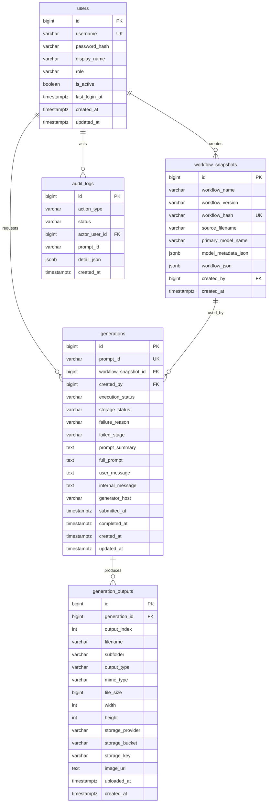

# 1차 MVP 목표 ERD 정리

## 목적

이 문서는 `컴피유아이-1차-mvp-통합-작업표.csv`의 `AI-501 ~ AI-508`, `AI-601 ~ AI-605`, `AI-701 ~ AI-702`, `AI-801 ~ AI-802`까지 모두 완료됐다고 가정했을 때의 **목표 ERD**를 정리한 상위 문서다.

즉, 현재 이미 구현된 스키마만 다시 적는 문서가 아니라:

- 생성 요청
- `/prompt -> /history` 폴링
- S3 업로드
- 결과 목록 / 상세 / 다운로드
- 로그인 / 실패 로그 조회

까지 전부 연결된 뒤 최종적으로 어떤 테이블과 컬럼이 있어야 하는지를 한 번에 보는 문서다.

## 설계 전제

- AI 도구 DB는 `tools/infra` 기준 별도 Postgres 컨테이너 / 별도 DB 문맥을 사용한다.
- ComfyUI 실행 상태와 S3 업로드 상태는 **같은 상태 컬럼으로 섞지 않고 분리**한다.
- 결과 이미지는 S3에 저장하고, DB에는 조회 / 다운로드 / 운영 추적에 필요한 메타데이터를 저장한다.
- 로그인은 내부용 최소 로그인 기준으로 보고, 세션 또는 토큰은 애플리케이션 계층에서 처리하며 별도 세션 테이블은 MVP에서 생략한다.
- `workflow_snapshots`는 수정형 테이블이 아니라 **immutable snapshot**으로 본다.

## 목표 ERD

## 테이블별 역할

### `users`

내부 사용자 계정과 접근 권한의 최소 기준을 가진다.

핵심 역할:

- 로그인 식별자 관리
- 생성자 필터 기준
- 관리자용 실패 로그 화면 접근 구분

권장 필드:

- `username`: 내부 로그인 ID
- `password_hash`: 간단 ID/PW 로그인 기준
- `display_name`: 목록 / 실패 로그 / 상세 화면 표시명
- `role`: `USER`, `ADMIN`
- `is_active`: 비활성화 처리
- `last_login_at`: 최근 접속 시각

메모:

- 별도 `sessions` 테이블은 MVP에서 필수로 보지 않는다.
- 세션 / JWT는 애플리케이션 레벨에서 처리하고, DB에는 계정 정보만 둔다.

### `workflow_snapshots`

ComfyUI workflow 원본과 메타데이터를 재현 가능한 단위로 저장한다.

핵심 역할:

- 같은 workflow 재사용 기준
- workflow JSON 다운로드 원본
- 결과 상세 화면의 workflow / 모델 정보 source of truth

권장 필드:

- `workflow_name`
- `workflow_version`
- `workflow_hash`
- `source_filename`
- `primary_model_name`
- `model_metadata_json`
- `workflow_json`

메모:

- `workflow_hash`는 같은 workflow인지 판별하는 기준 키다.
- `workflow_json`은 DB의 재현 기준 원본이다.
- `model_metadata_json`에는 UNET / LoRA / CLIP / VAE 같은 모델 조합 정보를 묶는다.

### `generations`

생성 요청 1건 자체를 기록하는 중심 테이블이다.

핵심 역할:

- `prompt_id` 기준 ComfyUI 실행 추적
- 생성 상태 / 업로드 상태 분리 관리
- 결과 목록 / 상세 / 실패 로그의 공통 중심축

권장 필드:

- `prompt_id`
- `workflow_snapshot_id`
- `created_by`
- `execution_status`
- `storage_status`
- `failure_reason`
- `failed_stage`
- `prompt_summary`
- `full_prompt`
- `user_message`
- `internal_message`
- `generator_host`
- `submitted_at`
- `completed_at`
- `created_at`
- `updated_at`

#### `execution_status`

ComfyUI 실행 자체의 상태다.

권장 값:

- `SUBMITTED`
- `RUNNING`
- `SUCCEEDED`
- `FAILED`
- `TIMED_OUT`

#### `storage_status`

S3 업로드 상태다. `execution_status`와 분리한다.

권장 값:

- `NOT_STARTED`
- `UPLOADING`
- `UPLOADED`
- `UPLOAD_FAILED`

이렇게 분리하는 이유:

- ComfyUI 생성 성공과 S3 업로드 성공은 같은 단계가 아니다.
- `execution_status = SUCCEEDED`인데 `storage_status = UPLOAD_FAILED`가 가능하다.
- `AI-508-02`의 uploaded / success 경계를 테이블 구조에서 명확히 처리할 수 있다.

#### `failure_reason`

권장 값:

- `HISTORY_FETCH_FAILED`
- `COMFYUI_REPORTED_FAILURE`
- `OUTPUT_MISSING`
- `POLL_TIMEOUT`
- `UNKNOWN_FAILURE`
- 이후 `UPLOAD_FAILED` 계열 세부 사유 추가 가능

#### `failed_stage`

권장 값:

- `PROMPT_SUBMIT`
- `GENERATION`
- `HISTORY_POLL`
- `OUTPUT_DISCOVERY`
- `S3_UPLOAD`
- `METADATA_SAVE`

메모:

- `prompt_summary`는 목록용 짧은 텍스트다.
- `full_prompt`는 상세 화면 접이식 원문이다.
- `user_message`는 사용자 노출용, `internal_message`는 운영 진단용으로 분리한다.

### `generation_outputs`

실제 결과 파일 메타데이터를 저장한다.

핵심 역할:

- 대표 이미지 / 다중 결과 이미지 연결
- 다운로드 / signed URL / 프록시 다운로드 기준
- S3 업로드 결과 추적

권장 필드:

- `generation_id`
- `output_index`
- `filename`
- `subfolder`
- `output_type`
- `mime_type`
- `file_size`
- `width`
- `height`
- `storage_provider`
- `storage_bucket`
- `storage_key`
- `image_url`
- `uploaded_at`
- `created_at`

메모:

- `(generation_id, output_index)` unique를 두면 multi-output workflow까지 열어둘 수 있다.
- `storage_key`는 S3 signed URL 발급이나 프록시 다운로드에 유용하다.
- `image_url`은 외부 조회용 경로, `storage_key`는 실제 객체 식별자 역할을 맡는다.

### `audit_logs`

운영 로그와 실패 추적의 최소 기준 테이블이다.

핵심 역할:

- 로그인 / 생성 / 업로드 / 다운로드 실패 추적
- 관리자 실패 목록 API source
- 최근 24시간 / 7일 운영 로그 조회 기준

권장 필드:

- `action_type`
- `status`
- `actor_user_id`
- `prompt_id`
- `detail_json`
- `created_at`

권장 값:

- `action_type`: `LOGIN`, `GENERATE`, `UPLOAD`, `DOWNLOAD`
- `status`: `SUCCESS`, `FAILED`

메모:

- timeout은 별도 audit status로 분리하지 않고 `FAILED + detail_json.failureReason = POLL_TIMEOUT`으로 본다.
- `detail_json`에 `generationId`, `executionStatus`, `failureReason`, `internalMessage` 등을 묶는다.

## 관계 요약

- `users 1:N workflow_snapshots`
- `users 1:N generations`
- `workflow_snapshots 1:N generations`
- `generations 1:N generation_outputs`
- `users 1:N audit_logs`

추적 흐름:

1. 사용자가 로그인한다.
2. 사용자가 workflow를 선택해 생성 요청을 보낸다.
3. generation row가 생성되고 `prompt_id`를 받는다.
4. `/history` polling으로 `execution_status`가 바뀐다.
5. output 파일을 찾고 S3에 올린다.
6. `generation_outputs`에 파일 메타데이터를 저장한다.
7. 업로드 / 실패 / 다운로드 이벤트를 `audit_logs`에 남긴다.

## 인덱스 권장안

### `users`

- `UNIQUE (username)`
- 필요 시 `INDEX (is_active)`

### `workflow_snapshots`

- `UNIQUE (workflow_hash)`
- `INDEX (created_by)`
- `INDEX (workflow_name)`

### `generations`

- `UNIQUE (prompt_id)`
- `INDEX (workflow_snapshot_id)`
- `INDEX (created_by)`
- `INDEX (execution_status)`
- `INDEX (storage_status)`
- `INDEX (created_at DESC)`
- `INDEX (created_by, created_at DESC)`

### `generation_outputs`

- `INDEX (generation_id)`
- `UNIQUE (generation_id, output_index)`
- 필요 시 `INDEX (storage_key)`

### `audit_logs`

- `INDEX (action_type)`
- `INDEX (status)`
- `INDEX (prompt_id)`
- `INDEX (actor_user_id)`
- `INDEX (created_at DESC)`

## 현재 구현 대비 나중에 더 붙을 필드

현재까지 구현한 스키마와 비교하면, 최종 MVP 관점에서 아래 값은 후속 단계에서 추가될 가능성이 높다.

- `users.password_hash`
- `users.role`
- `generations.storage_status`
- `generations.generator_host`
- `generations.submitted_at`
- `generation_outputs.file_size`
- `generation_outputs.width`
- `generation_outputs.height`
- `generation_outputs.storage_provider`
- `generation_outputs.storage_bucket`
- `generation_outputs.storage_key`
- `generation_outputs.uploaded_at`

즉, 현재 스키마는 `AI-504`까지의 기준선이고, 이 문서는 `AI-801`까지 완료됐을 때를 기준으로 한 목표 그림이다.

## 이 문서를 다시 볼 시점

- `AI-505` generation 메타데이터 저장 구현 전
- `AI-507`, `AI-508` S3 업로드 / 상태 갱신 구현 전
- `AI-601 ~ AI-605` 결과 조회 / 다운로드 API 설계 전
- `AI-701`, `AI-702` 로그인 / 실패 로그 조회 설계 전
